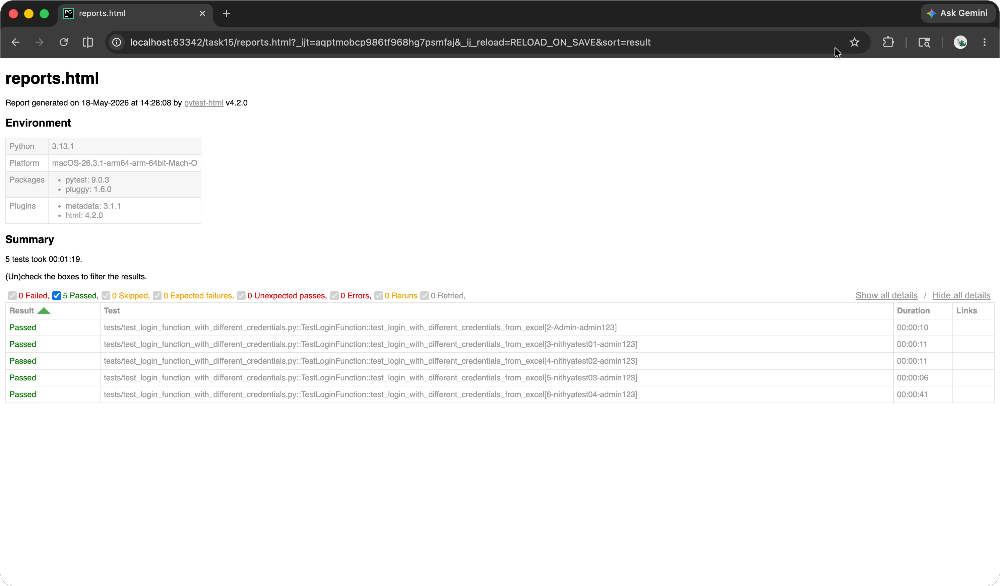

# Python Task 15 - Data Driven Testing Framework with POM

* To implement DDT Framework, I have used Pytest's parametrize function. Please check them in [test_login_function_with_different_credentials.py](./tests/test_login_function_with_different_credentials.py)
* User Credentials are read from the excel using the function get_username_password_from_excel() present in the file [excel_operation.py](./utilities/excel_operation.py)
* Similarly, results and date/time/teser_info are written back into the excel using the write_results_back_into_excel(row_num, date, time_of_test, name_of_tester, test_result) function present in the file [excel_operation.py](./utilities/excel_operation.py)
* Page Object Model is used and all the Page Objects are defined and placed in the folder [pages](./pages)
* Excel data are stored in the file named [test_data_and_reports.xlsx](./test_data_and_report.xlsx)
* Pytest HTML report is present here: [reports.html](./reports.html)

Please find the Report screenshot below for a quick reference:

